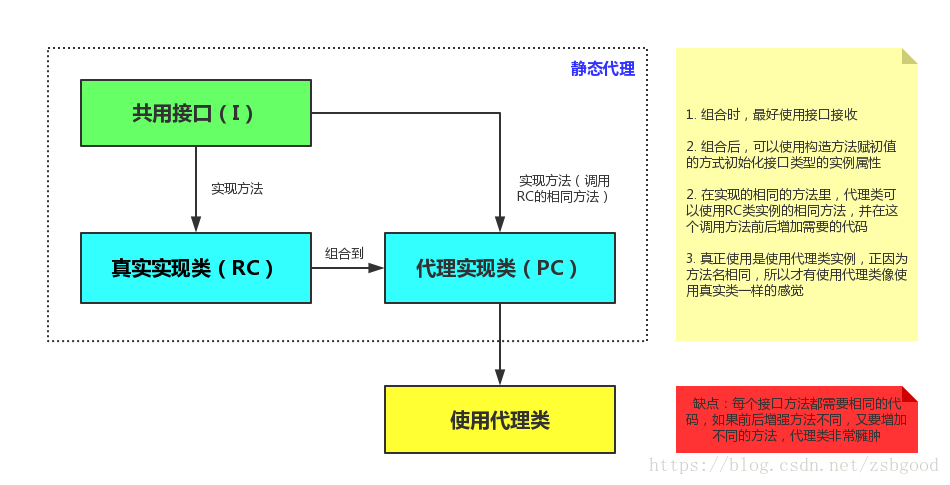
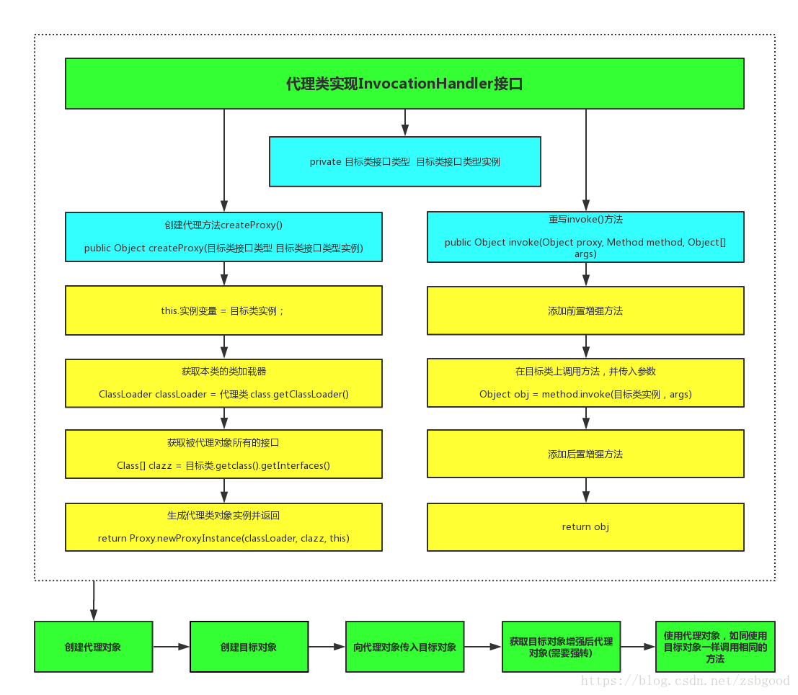
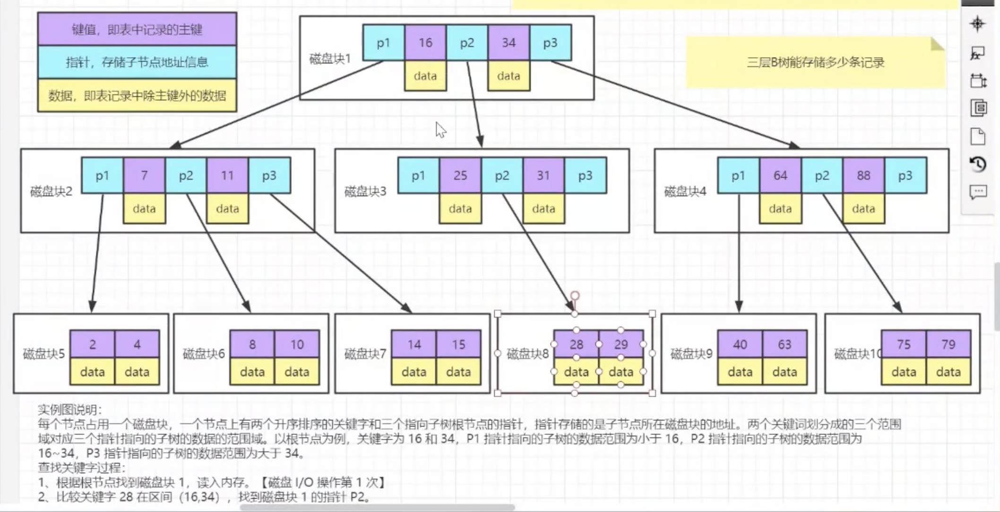
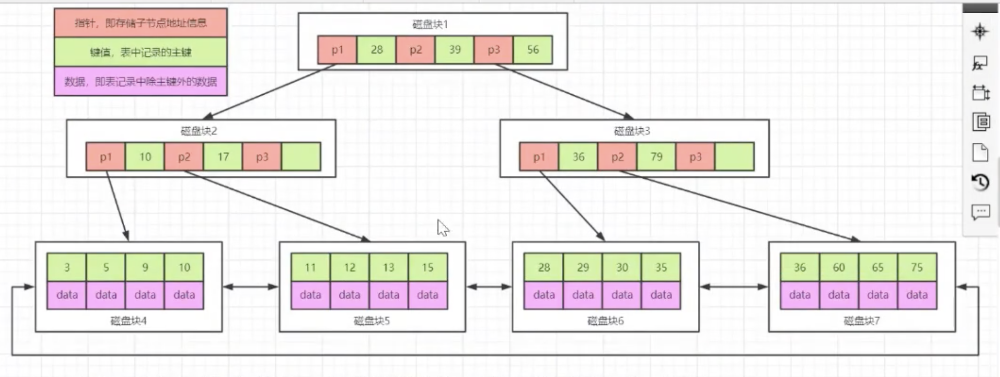
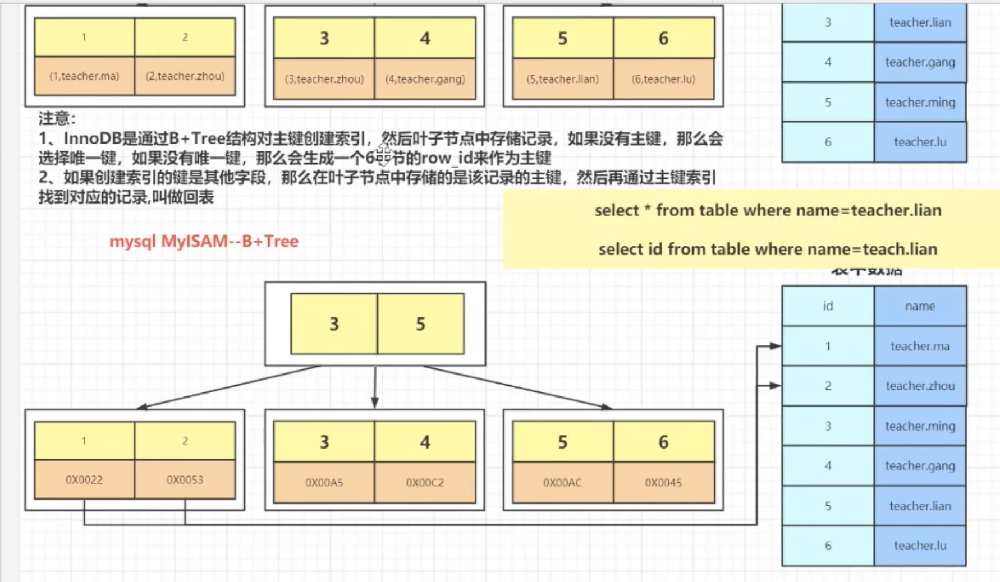
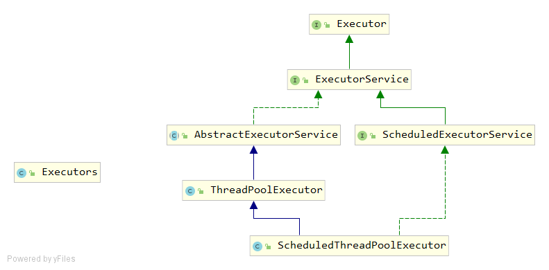
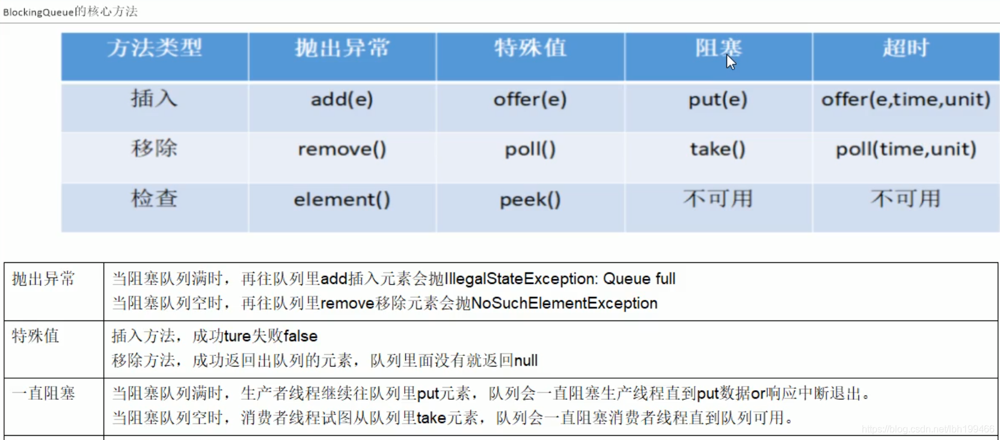
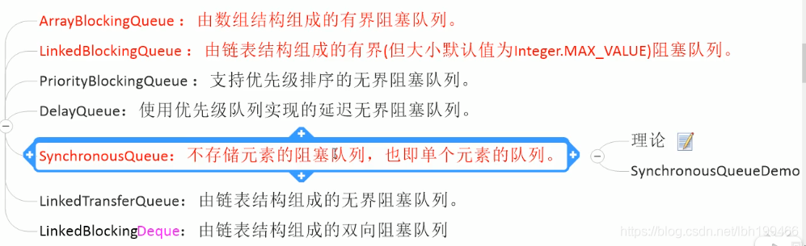

# AOP

## aop的几种实现


`HandleInterceptor`拦截器,`preHandle()`--`postHandle()`--`afterCompitition()`

需要注册：

```java
@Configuration
public class InterceptorRegister implements WebMvcConfigurer {
    @Override
    public void addInterceptors(InterceptorRegistry registry) {
        registry.addInterceptor(new RequestLogInterceptor()).addPathPatterns("/**");
    }
}
```


`MethodInterceptor`,配合注解的形式做aop,需要注入容器。


`@Aspect`配合@PointCut...@Before @Around @ After 

("execution(public 返回值 com.hwj.controller.TeController.方法(*) )")


## 代理模式

### 静态代理：




```java
public class ProxyTest {
    public static void main(String[] args) {
        Proxy proxy = new Proxy();
        proxy.Request();
    }
}
//抽象主题
interface Subject {
    void Request();
}
//真实主题
class RealSubject implements Subject {
    public void Request() {
        System.out.println("访问真实主题方法...");
    }
}
//代理
class Proxy implements Subject {
    private RealSubject realSubject;
    public void Request() {
        if (realSubject == null) {
            realSubject = new RealSubject();
        }
        preRequest();
        realSubject.Request();
        postRequest();
    }
    public void preRequest() {
        System.out.println("访问真实主题之前的预处理。");
    }
    public void postRequest() {
        System.out.println("访问真实主题之后的后续处理。");
    }
}
```

给真实的对象添加一些其他方法，这是静态代理，会出现代理类方法臃肿的问题。

### 动态代理：

**JDK动态代理和CGlib字节码动态代理**

#### jdk动态代理


动态代理就是为了解决静态代理不灵活的缺陷而产生的。静态代理是固定的，一旦确定了代码，如果委托类新增一个方法，而这个方法又需要增强，那么就必须在代理类里重写一个带增强的方法。而动态代理可以灵活替换代理方法，动态就是体现在这里。

JDK动态代理主要涉及java.lang.reflect包下边的两个类：*Proxy*和*InvocationHandler*。其中，InvocationHandler是一个接口，可以通过实现该接口定义横切逻辑（如：我们在方法执行前后打印的日志，本文只是为了演示，实际的应用一般不会只是简单的打印日志的），并通过反射机制调用目标类的代码，动态地将横切逻辑和业务逻辑编织在一起。


```java
public interface TargetClass {
    void sayHello();
}
public class TargetClassImpl implements TargetClass{
    public void sayHello() {
        System.out.println("你好");
    }
}
public class JdkProxy implements InvocationHandler {
    private TargetClass targetClass;
    public Object createProxy(TargetClass targetClass){
        //传入真实实现类, 本身要做的事情会由他自己做, 代理类会额外进行其他增强操作
        this.targetClass = targetClass; 
        //获取本类类加载器
        ClassLoader classLoader = JdkProxy.class.getClassLoader();
        ///获取被代理对象的所有接口
        Class[] clazz = targetClass.getClass().getInterfaces();
        System.out.println(clazz.length);
        //生成代理类并返回
        return Proxy.newProxyInstance(classLoader, clazz, this);
    }
    public Object invoke(Object proxy, Method method, Object[] args) throws Throwable {
        System.out.println("JDKProxy前置增强");
        Object obj = method.invoke(targetClass,args);
        System.out.println("JDKProxy后置增强");
        return obj;
    }
}

public class Test {
    public static void main(String[] args) {
		JdkProxy jdkProxy = new JdkProxy();
		TargetClass targetClass = new TargetClassImpl();
		TargetClass targetClass1 = (TargetClass) jdkProxy.createProxy(targetClass);
		targetClass1.sayHello();
}

```


```java
public interface TargetClass {
    void sayHello();
}
public class TargetClassImpl implements TargetClass{
    public void sayHello() {
        System.out.println("你好");
    }
}
public class JdkProxy implements InvocationHandler {
    private TargetClass targetClass;
    
  	public JdkProxy(TargetClass targetClass){
      this.targetClass = targetClass
    }
    public Object invoke(Object proxy, Method method, Object[] args) throws Throwable {
        System.out.println("JDKProxy前置增强");
        Object obj = method.invoke(targetClass,args);
        System.out.println("JDKProxy后置增强");
        return obj;
    }
}


public class DynamicProxyDemonstration
{
    public static void main(String[] args)
    {
        //代理的真实对象
        TargetClass targetClass = new TargetClassImpl();
        
        /**
         * InvocationHandlerImpl 实现了 InvocationHandler 接口，并能实现方法调用从代理类到委托类的分派转发
         * 其内部通常包含指向委托类实例的引用，用于真正执行分派转发过来的方法调用.
         * 即：要代理哪个真实对象，就将该对象传进去，最后是通过该真实对象来调用其方法
         */
        InvocationHandler handler = new InvocationHandlerImpl(targetClass);
 
        ClassLoader loader = targetClass.getClass().getClassLoader();
        Class[] interfaces = targetClass.getClass().getInterfaces();
        /**
         * 该方法用于为指定类装载器、一组接口及调用处理器生成动态代理类实例
         */
       TargetClass targetClass = (TargetClass) Proxy.newProxyInstance(loader, interfaces, handler);
 
        System.out.println("动态代理对象的类型："+targetClass.getClass().getName());
 
        String hello = targetClass.SayHello();

    }
 
}
```

#### CGlib字节码动态代理

JDK动态代理利用的是*反射*机制。CGLIb基于**ASM**的字节码生成库，允许在运行的时候对字节码进行修改和动态生成。CGLIB通过继承方式实现代理（所以不能使用final修饰类），修改字节码在子类中采用方法拦截的技术拦截所有父类方法的调用并顺势织入横切逻辑。使用的是 org.springframework.cglib.proxy.Enhancer

```java
public class HelloServiceImpl {
    public void sayHello(){
        System.out.println("Hello Zhanghao");
    }
    public void sayBey(){
        System.out.println("Bye Zhanghao");
    }
}

public class HelloMethodInterceptor  implements MethodInterceptor{
    @Override
    public Object intercept(Object o, Method method, Object[] objects, MethodProxy methodProxy) throws Throwable {
        System.out.println("Before: "  + method.getName());
        Object object = methodProxy.invokeSuper(o, objects);
        System.out.println("After: " + method.getName());
        return object;
    }
}
public class Client {
    public static void main(String[] args) {
        System.setProperty(DebuggingClassWriter.DEBUG_LOCATION_PROPERTY, "/Users/zhanghao/Documents/toy/spring-framework-source-study/");
        Enhancer enhancer = new Enhancer();
        //继承被代理类
        enhancer.setSuperclass(HelloServiceImpl.class);
        //设置回调
        enhancer.setCallback(new HelloMethodInterceptor());
        //设置代理类对象
        HelloServiceImpl helloService = (HelloServiceImpl) enhancer.create();
        //在调用代理类中方法时会被我们实现的方法拦截器进行拦截
        helloService.sayBey();
    }
}
result:
Before: sayBey
Bye Zhanghao
After: sayBey
```


# 数据库

## MySQL内部执行过程

MySQL结构分成了：连接层，SQL层，存储引层

### 连接层

* 通过连接协议：tcp/ip 以及 socket 连接；

* 登录验证：验证用户名、密码、IP、端口号等合法性；

* 提供连接线程：接收用户 SQL 语句以及返回结果（使用 `show processlist` 命令可以查看用户连接的线程情况）

* 将请求传递给下一层，SQL 层。

### SQL层

* 接收上层的sql语句

* 进行语法检查，满足SQL_MODE

* 语义检查，DDL,DCL,DML,DQL
* 权限检查
* **解析器，优化器，执行器**
* 执行器提供给存储引擎层一个查询结果在磁盘位置的信息
* （默认不开启）查询缓存，日志记录

### 存储引擎层

存储引擎层的作用：

1. 根据 SQL 的执行结果，去磁盘上找到相应数据。
2. 找到磁盘上的 16 进制数据，再次返回 SQL 层，结构化成二维表的方式，再由连接层的专用线程返回用户，最终展现出来


## MySQL物理存储结构

/data/mysql/data里面的就是目录就是数据库


MyISAM引擎一张表对应三个文件

- `user.frm`：存储表结构（列、属性）
- `user.MYD`：存储的数据记录
- `user.MYI`：存储索引

InnoDB引擎：两个文件

* `user.frm`：表的结构
* `user.ibd`:表的数据记录和索引

## 用户操作

```
create user user1@'localhost' identified by '123'
select user,host from mysql.user;
alert user user1@'localhost' identified by '1234'
drop user user1@'localhost' 
```

权限操作

```
grant 权限 on 作用目标(库.表) on 用户 identified by 密码 with grant option
```

## 基础应用

charset（字符类型），collation（排序规则）

数据类型：tinyint,smallint,mediumint,int,bigint,float,double,decimal,bit

​				char(定长),varchar(变长)

### DDL

```
create database account charset utf8mb4 collate utf8mb4_ci
```

### DQL

```
select * from *  where * group by * order by * limit 
```

## 事务

* 读未提交：一个事务写，另一个事务只可以读，出现脏读
* 读已提交：一个事务读，另一个事务可以读写，一个事务写，另一个事务不可以读写。
* 可重复读：一个事务读，其他事务只能读，写事务禁止其他事务
* 串行化：

## 索引

* mysql文件存储在磁盘中，每次读取需要过IO，这是限制点，包括IO次数和IO数据量

* 局部性原理：是指CPU访问[存储器](https://baike.baidu.com/item/存储器/1583185)时，无论是存取指令还是存取数据，所访问的[存储单元](https://baike.baidu.com/item/存储单元/8727749)都趋于聚集在一个较小的连续区域中。

* 磁盘预读：内存从磁盘每次读取页（4k），磁盘预读每次读取页的整数倍

* 普通索引应该存储的信息：实际的索引列的值（key），文件地址，偏移量。

  * 这种形式的索引会很大，对于OLAP是可以的
  * 但是对于OLTP来说，这种大索引不合适快速返回数据

* 索引的存储结构：

  * hash表：
    * 优点：等值查询快，
    * 缺点：散列不均匀的时候，查询时间长；内存占用大；范围查询需要个个比对
    * memory引擎会使用hash索引，innodb也会自适应。
  * 二叉树和二叉搜索树：降低时间复杂度，但是无法保持平衡，可能退化成链表
  * AVL平衡二叉树：通过降低插入的效率（左旋，右旋）损失来提高获取数据的效率
  * 红黑树：让插入效率和获取数据的效率类似平衡
    * 二叉树的普遍缺点：随着节点增多，树的深度变大，IO次数会上升
  * b树：现在不使用二叉树，而是使用多叉树来进行操作。

  

  * B+树

    * 叶子节点才存储数据，非叶子节点不存储数据。一般来说三层或者四层就够了

    

* 聚簇索引：索引和数据是否在同一个文件中，向聚簇索引的存储引擎(innodb)插入数据时，必须有索引的key值，这个值是**主键，唯一键，或者六字节的rowid**

* 所以innodb中key和数据放在一起，而myisam中key和指向数据文件的指针一起存放。



* 综上：key是关键数据，如果创建新的索引，新索引的key就是定义的某个字段数据，此时的data就是最初表的key

```sql
id name gander age四个字段，其中id是主键，name是索引列、
select * from user where name = 'zhansan'
此时要先根据索引列的name查到id，在根据id查到data数据，走了两颗b+树

select id,name from user 
走了一颗b+树
```

* 回表：先根据普通索引列查询到聚簇索引的id，再根据聚簇索引查询到聚体的数据

* 索引覆盖：根据普通索引查询到后，不需要再根据聚簇索引查询
* 最左匹配

```sql
组合索引：name_age
select * from where name = ? and age = ?
select * from where name =?
select * from where age = ? and name = ?
select * from where age = ?
1,2,3会使用该索引
```

* 索引下推

```
select * from user where name = ? and age = ?
没有索引下推：从存储引擎根据name条件拿数据，再从serve中对age进行过滤
有索引下推：在存储引擎中根据name和age两个条件拿数据
```


## 存储引擎

### innodb

底层是B+树<https://blog.csdn.net/u013411246/article/details/81088914>-<https://zhuanlan.zhihu.com/p/27700617>

* InnoDB给MySQL提供了具有提交、回滚和崩溃恢复能力的事务安全（ACID兼容）存储引擎。
* InnoDB锁定在行级（行级锁）并且也在SELECT语句中提供一个类似[**Oracle**](http://lib.csdn.net/base/oracle)的非锁定读。
* InnoDB是为处理巨大数据量的最大性能设计。它的CPU效率可能是任何其他基于磁盘的关系型数据库引擎锁不能匹敌的
* InnoDB存储引擎为在主内存中缓存数据和索引而维持它自己的缓冲池。
* InnoDB将它的表和索引在一个逻辑表空间中，表空间可以包含数个文件（或原始磁盘文件）。这与MyISAM表不同，比如在MyISAM表中每个表被存放在分离的文件中。InnoDB表可以是任何尺寸，即使在文件尺寸被限制为2GB的操作系统上
* InnoDB支持外键完整性约束
* InnoDB不创建目录，使用InnoDB时，MySQL将在MySQL数据目录下创建一个名为ibdata1的10MB大小的自动扩展数据文件，以及两个名为ib_logfile0和ib_logfile1的5MB大小的日志文件

### MyISAM


## 优化

### mysql自带工具

```
show profiles;
show profile [type] for query queryid;

https://dev.mysql.com/doc/refman/8.0/en/show-profile.html
```

```
performance_scheme
```

```
show processlist
```

### 数据类型

* 越小越好
* 类型匹配，该是date就是date，该是varchar就varchar
  * 遇到ip可以使用INET_ATON(ip),INET_NTOA(数字)相互转换，但是可读性比较差
* char用于存储固定字符，经常更新的操作，会删除末尾的空格，检索效率高
* 使用枚举类型，非常紧凑，将字符和数字做映射在frm文件中 gander enum('man','woman')
* 


# java

https://github.com/Jstarfish/JavaKeeper

## java的stream流操作

​	创建流——>中间操作——>收集流、

https://juejin.cn/post/6995071312695656456

创建流：

```
通过集合的stream()方法

Arrays工具类的stream(array)为数组创建流

Stream.of(...value)
Stream.iterate(0, (x) -> x + 3)
Stream.generate(Math::random)
```


中间操作:

```
map(mapToInt,mapToLong,mapToDouble)转换操作
flatmap(flatmapToInt,flatmapToLong,flatmapToDouble) 拍平操作
limit
distint
filter
peek
skip
sorted 实现了compareable接口
```

收集流：

```
collect 将数据收集，使用collector收集器
count 统计个数
findFirst/findAny 查找
noneMatch/allMatch/anyMatch匹配操作
min、max 最值操作，需要自定义比较器，返回数据流中最大最小的值。
reduce 规约操作，将整个数据流的值规约为一个值，count、min、max底层就是使用reduce
forEach、forEachOrdered 遍历操作，这里就是对最终的数据进行消费了。
toArray 数组操作，将数据流的元素转换成数组。
```

# 多线程

## CAS

Compare and set

针对于原子，无法对多个数据就行操作；并发较大时会一直自旋，比如说10个线程都执行一百次临界区值+1的操作。

比较理论值和实际值，相等才赋其他值，（值的内存地址，旧的预期值，需要的替换值）


ABA问题

线程1，2都想把100改成50，而线程3是后来的把50改成100

线程1把100改成50

线程2卡住了，

线程3把50改成了100。

此时线程2启动又改成50.

但是理想上是需要改成100.


使用版本号解决。


## 线程池

作用：减少线程创建和销毁时，资源的损耗和时间的花费。还可以统一管理线程。




### 线程池的创建方式

```java
    public ThreadPoolExecutor(int corePoolSize,
                              int maximumPoolSize,
                              long keepAliveTime,
                              TimeUnit unit,
                              BlockingQueue<Runnable> workQueue,
                              ThreadFactory threadFactory,
                              RejectedExecutionHandler handler)
      
      生产中不使用Executor的静态方法创建线程池，而是使用该构造方法。
```

corePoolSize常驻线程数，maximumPoolSize最大线程数，keepAliveTime多余线程存活时间。

到达该时间，多余线程会被销毁，只剩下常驻线程数

workQueue被提交未执行的任务

threadFactory:生成工作线程的线程工厂。

handler，拒绝策略：线程队列满了，且工作线程大于最大线程数，应该采取什么用的策略。

### 线程池的工作

* 创建线程池，等待任务
* 任务来临
  * 如果正在运行线程数小于常驻线程数，则创建线程来运行该任务
  * 如果等于或者大于，则将任务放入workQueue
* workQueue满了
  * 如果线程数小于最大线程数，创建线程执行任务。
  * 如果线程数大于或者等于最大线程数，就拒绝策略
* 线程完成任务会继续工作，直到无事可做后的到达最大时间，被销毁

### 拒绝策略

* AbortPolicy:抛出RejectedException异常，阻止系统运行
* CallerRunsPolicy:"调用者运行"一种调节机制，该策略既不会抛弃任务，也不会抛出异常，而是由提交任务者执行这个任务
* DiscardOldestPolicy:抛弃最长等待者
* DiscardPolicy：抛弃最后进来任务


### blockQueue







# 操作系统

## 进程

### 进程的创建

* 系统初始化
* 正在运行的程序执行了创建进程的系统调用（fork ）
* 用户请求创建进程
* 初始化一个批处理工作

### 进程和线程的区别

进程是处理器分配资源的基本单位，

线程是调度运行的基本单位。

### 进程通信

管道

信号

消息队列

共享内存

信号量

套接字
